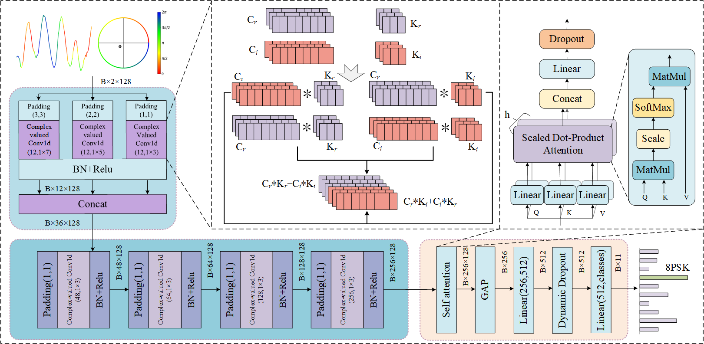

# MCCFN 

The article is currently under submission. We will upload the full code immediately upon acceptance.

## Preparation

Data

Experiments were conducted on four datasets: RMLradio2016.10a, RMLradio2016.10b and RML22.

The dataset can be downloaded from the [DeepSig](https://www.deepsig.ai/datasets/) official website.

### Environment Setup

- pytorch = 2.4.0
- cuda = 11.8
- python = 3.8

Comparison with other models on the 2016a dataset.

Compare model:[MCDformer](https://github.com/JHL-HUST/MCDformer),[AWN](https://github.com/zjwfufu/AWN),[AvgNet](https://github.com/jcz111/AvgNet),[PETCGDNN](https://github.com/Richardzhangxx/PET-CGDNN)and CLDNN

Some of the code is borrowed from [MCDformer](https://github.com/JHL-HUST/MCDformer),[AWN](https://github.com/zjwfufu/AWN),[CDSCNN](https://github.com/Patrick-Nick/CDSCNN) and we thank them for their excellent work.

​    

​    

